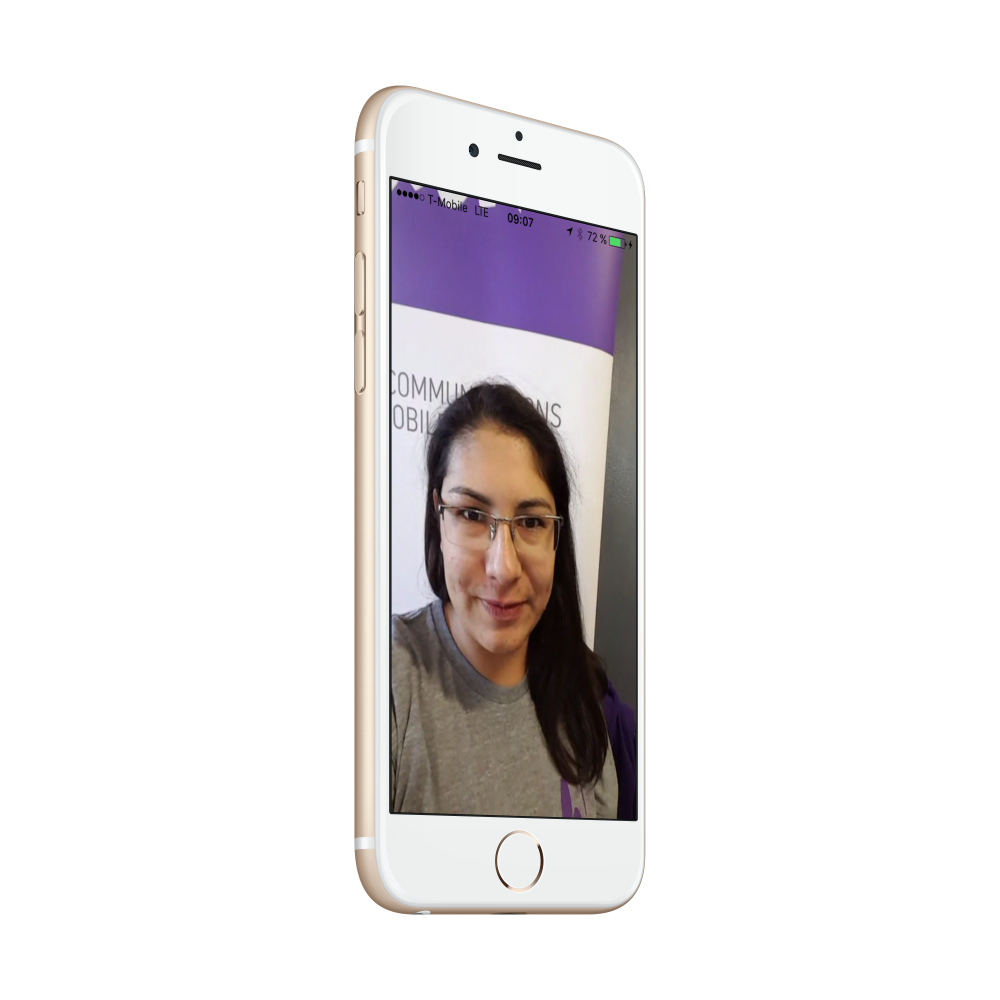

# Video calling with sinch
Today we are introducing Video calling as public beta for iOS/Android and JS, as usual we have focused on how to make it a easy as possible to make a video call. Infact in this beta its just like make a call with sinch client. If you want to learn how to set up that from scratch you can look [here](https://www.sinch.com/tutorials/ios-simple-voice-app-tutorial/)



Today we are going to look at what makes a video call different from the regular calling. The obvious reason is of course the video. Lets dive in to the code from the sample app we ship with the [SDK](https://www.sinch.com/downloads/#videosdk). Its worth noting that the beta is **not** available via cocoa pods, so if you want to add the beta to an existing project you need to do it old school by hand and add the required frameworks, also the sinchservice we provide is not supported either right now. Check out the [documentation](https://www.sinch.com/docs/video/ios/) to see the exact things to add.

Open up the SinchVideo located in the samples directory, and when you look around its the same setup as usual with our Voice calling. Open up the **appDelegate.m** and and add your key and secret in:

```
- (void)initSinchClientWithUserId:(NSString *)userId {
  if (!_client) {
    _client = [Sinch clientWithApplicationKey:@"<APPLICATION KEY>"
                            applicationSecret:@"<APPLICATION SECRET>"
                              environmentHost:@"sandbox.sinch.com"
                                       userId:userId];
    _client.delegate = self;
    [_client setSupportCalling:YES];
    [_client setSupportActiveConnectionInBackground:YES];
    [_client start];
    [_client startListeningOnActiveConnection];
  }
}
```

until you look in **CallViewController.m** 
The first thing you will notice is 

```
- (id<SINVideoController>)videoController {
  return [[(AppDelegate *)[[UIApplication sharedApplication] delegate] client] videoController];
}
```
This takes care of all the Video stuff for you, like disabling the idle timer so the screen does not go blank, providing you with a view of your self and the remote stream. 
The next thing that is different is you have two views as IBOutlets where we will show the video. 


```
- (void)viewDidLoad {
  [super viewDidLoad];
  if ([self.call direction] == SINCallDirectionIncoming) {
    [self setCallStatusText:@""];
    [self showButtons:kButtonsAnswerDecline];
    [[self audioController] startPlayingSoundFile:[self pathForSound:@"incoming.wav"] loop:YES];
  } else {
    [self setCallStatusText:@"calling..."];
    [self showButtons:kButtonsHangup];
  }

  [self.localVideoView addSubview:[[self videoController] localView]];

  [self.localVideoFullscreenGestureRecognizer requireGestureRecognizerToFail:self.switchCameraGestureRecognizer];
  [[[self videoController] localView] addGestureRecognizer:self.localVideoFullscreenGestureRecognizer];
  [[[self videoController] remoteView] addGestureRecognizer:self.remoteVideoFullscreenGestureRecognizer];
}

- (IBAction)onSwitchCameraTapped:(id)sender {
  AVCaptureDevicePosition current = self.videoController.captureDevicePosition;
  self.videoController.captureDevicePosition = SINToggleCaptureDevicePosition(current);
}
- (IBAction)onFullScreenTapped:(id)sender {
  UIView *view = [sender view];
  if ([view sin_isFullscreen]) {
    view.contentMode = UIViewContentModeScaleAspectFit;
    [view sin_disableFullscreen:YES];
  } else {
    view.contentMode = UIViewContentModeScaleAspectFill;
    [view sin_enableFullscreen:YES];
  }
}

```

As soon as you load this view the localStream is added to the view, this is important because you want to make sure you look you best when the other party picks up. There is also a gestureRecognizer to enable you to switch to full screen, and one to toggle front or back facing camera.

The next key part in the call is

```
- (void)callDidAddVideoTrack:(id<SINCall>)call {
  [self.remoteVideoView addSubview:[[self videoController] remoteView]];
}
```

This is where we add the remote video to the stream to the view. And that folks is really all there is to it to enable group calling. 

Download the sdk and give it a spin :)


